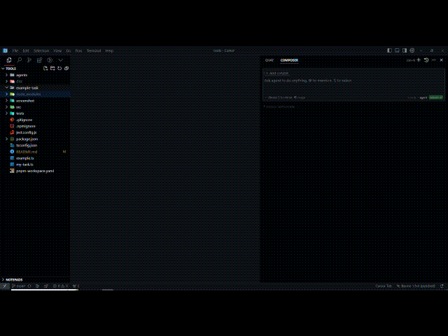
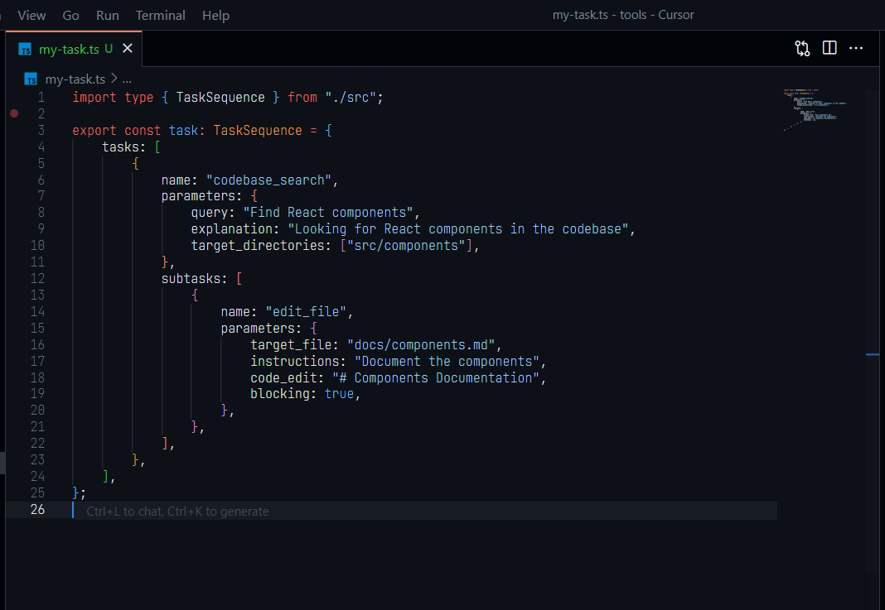
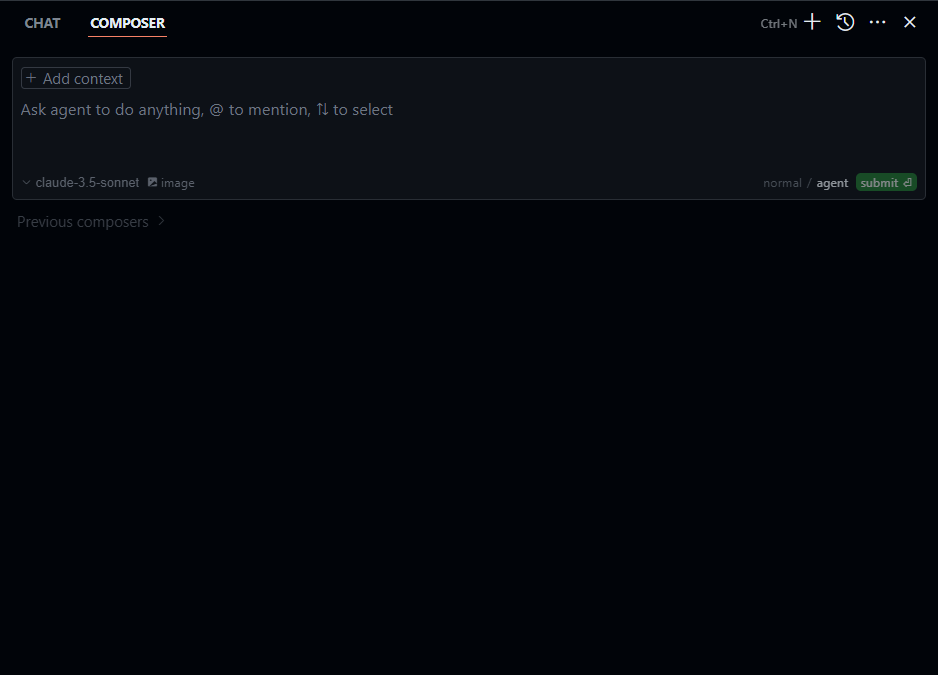
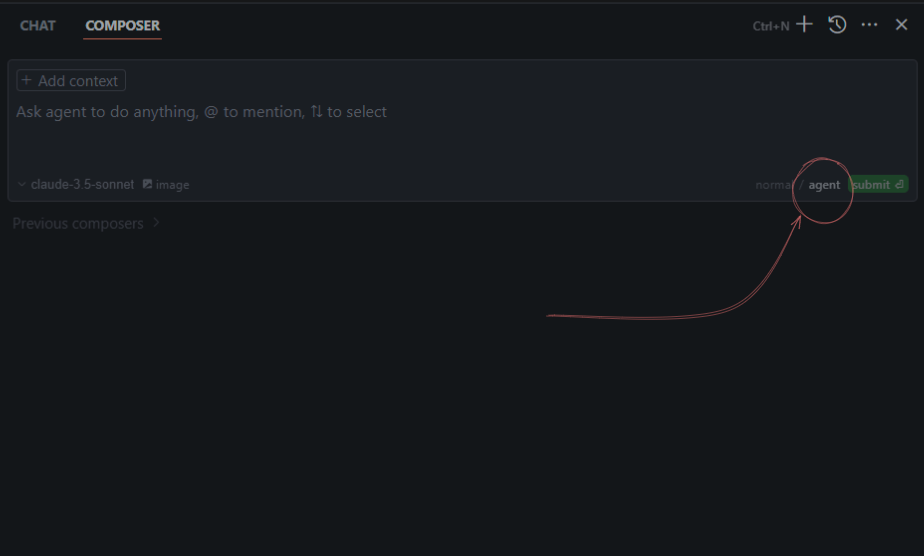
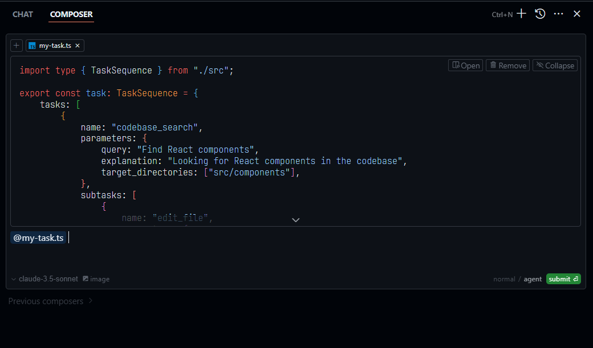
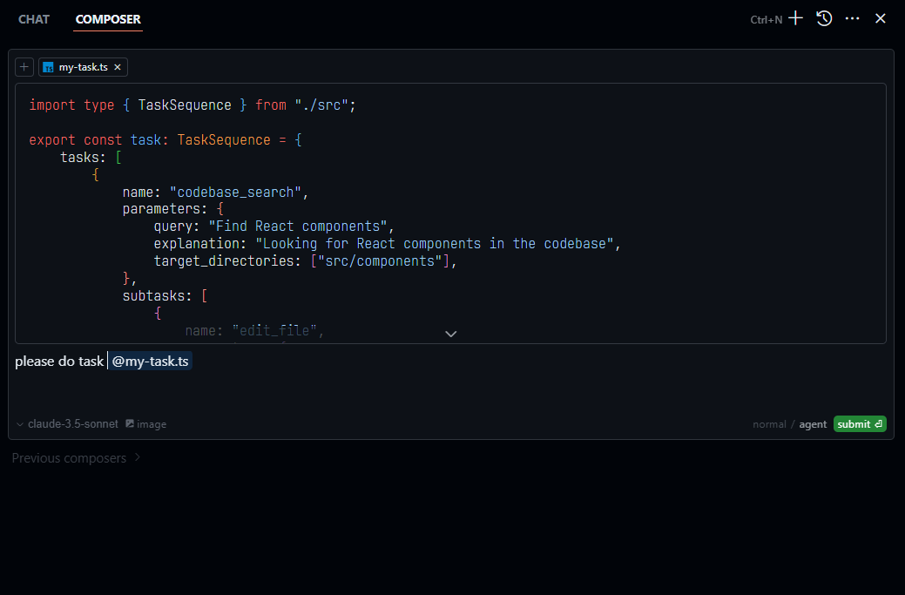
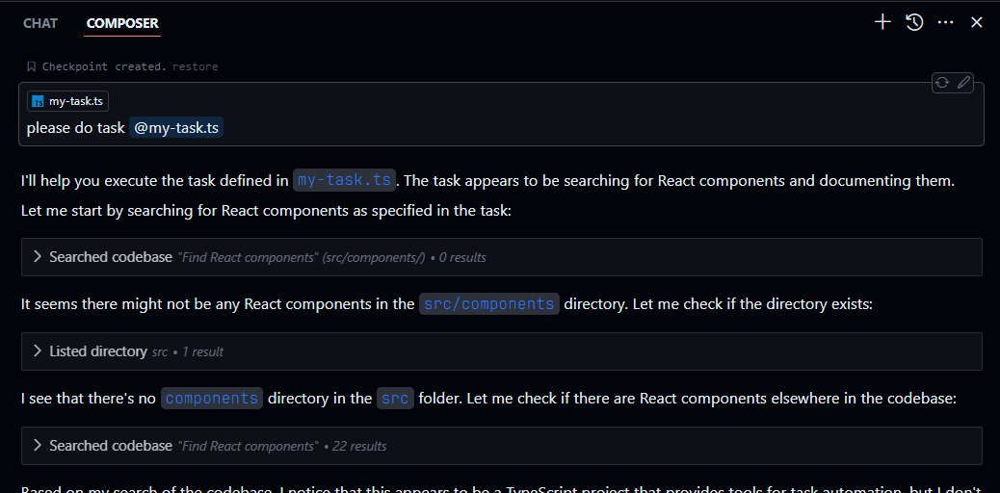

# Cursor Agent
## 🎯 Precision-Engineered AI Workflows

A TypeScript library for creating structured task sequences for Cursor AI agents. This library provides type-safe builders for creating complex task sequences that can be used with Cursor AI.

> **Key Advantage**: This package closely mirrors the internal methods used by Cursor AI's system behind the scenes. By utilizing the same task structures and patterns that Cursor AI uses internally ([see internal tool structure](agents/tool_call.json) and [detailed documentation](docs/tools.mdx)), your task sequences will generate highly effective and optimized prompts that align perfectly with Cursor AI's capabilities.

## 🎥 Quick Demo



## Installation

Using pnpm:
```bash
pnpm add cursor-agent
```

Using npm:
```bash
npm install cursor-agent
```

Using yarn:
```bash
yarn add cursor-agent
```

## Getting Started

1. Create a task file (e.g., `my-task.ts`):
```typescript
import type { TaskSequence } from 'cursor-agent';

export const task: TaskSequence = {
  tasks: [
    {
      name: "codebase_search",
      parameters: {
        query: "Find React components",
        explanation: "Looking for React components in the codebase",
        target_directories: ["src/components"]
      },
      subtasks: [
        {
          name: "edit_file",
          parameters: {
            target_file: "docs/components.md",
            instructions: "Document the components",
            code_edit: "# Components Documentation",
            blocking: true
          }
        }
      ]
    }
  ]
};
```

2. Use with Cursor Composer:
   - Open Cursor IDE
   - Open the Composer (Cmd/Ctrl + Shift + P)
   - Make sure you're in "Agent" mode
   - Attach your task file to the conversation
   - Write a simple prompt like: "please do this @my-task.ts"

Example prompts:
```
Please execute this task @my-task.ts
Can you run this task sequence @my-task.ts
Execute the documentation task @my-task.ts
```

The Cursor AI agent will read your task sequence and execute each task in order, including any subtasks.

## Visual Guide

### 1. Create Task File
Create a new TypeScript file with your task sequence:
```
my-project/
├── src/
└── tasks/
    └── my-task.ts  <- Create your task here
```

### 2. Visual Examples

  
### 3. Open Cursor Composer
Use Cmd/Ctrl + Shift + B to open the Composer


### 4. Switch to Agent Mode
Make sure "Agent" mode is selected


### 5. Attach Task File

Click the attachment icon or drag and drop your task file

### 6. Execute Task

Type your prompt: "please do this @my-task.ts"


### 7. Done!, Iterate or attach another task



## Usage

### Basic Example

```typescript
import { 
  createCodebaseSearchTask,
  createEditFileTask,
  TaskSequence 
} from 'cursor-agent';

// Create a simple task sequence
const task: TaskSequence = {
  tasks: [
    createCodebaseSearchTask({
      query: "Find components",
      explanation: "Search for React components",
      target_directories: ["src/components"]
    })
  ]
};
```

### Task with Subtasks

```typescript
import { 
  createCodebaseSearchTask,
  createEditFileTask,
  createGrepSearchTask,
  createParallelApplyTask 
} from 'cursor-agent';

// Create a task with subtasks
const documentationTask = createCodebaseSearchTask(
  {
    query: "Find NextJS project structure",
    explanation: "Identify core components",
    target_directories: ["src", "app", "components"]
  },
  [
    createEditFileTask({
      target_file: "docs/architecture.mdx",
      instructions: "Create architecture documentation",
      code_edit: "# Project Architecture\n## Components",
      blocking: true
    })
  ]
);
```

### Complex Task Sequence

```typescript
import { 
  createListDirTask,
  createReadFileTask,
  createGrepSearchTask,
  createParallelApplyTask,
  TaskSequence 
} from 'cursor-agent';

// Create a complex task sequence for file processing
const task: TaskSequence = {
  tasks: [
    createListDirTask(
      {
        relative_workspace_path: "src",
        explanation: "List source files"
      },
      [
        createReadFileTask({
          relative_workspace_path: "src/index.ts",
          should_read_entire_file: true,
          start_line_one_indexed: 1,
          end_line_one_indexed_inclusive: 100,
          explanation: "Read index file"
        }),
        createGrepSearchTask({
          query: "export",
          include_pattern: "*.ts",
          explanation: "Find exports"
        })
      ]
    ),
    createParallelApplyTask({
      edit_plan: "Update exports",
      edit_regions: [
        {
          relative_workspace_path: "src/index.ts",
          start_line: 1,
          end_line: 100
        }
      ]
    })
  ]
};
```

## Available Task Creators

### 1. `createCodebaseSearchTask`
Search through the codebase with semantic queries.
```typescript
createCodebaseSearchTask({
  query: string;
  explanation?: string;
  target_directories?: string[];
});
```

### 2. `createReadFileTask`
Read file contents with line number control.
```typescript
createReadFileTask({
  relative_workspace_path: string;
  should_read_entire_file: boolean;
  start_line_one_indexed: number;
  end_line_one_indexed_inclusive: number;
  explanation?: string;
});
```

### 3. `createRunTerminalCmdTask`
Execute terminal commands safely.
```typescript
createRunTerminalCmdTask({
  command: string;
  is_background: boolean;
  require_user_approval: boolean;
  explanation?: string;
});
```

### 4. `createListDirTask`
List directory contents.
```typescript
createListDirTask({
  relative_workspace_path: string;
  explanation?: string;
});
```

### 5. `createGrepSearchTask`
Perform text-based searches.
```typescript
createGrepSearchTask({
  query: string;
  case_sensitive?: boolean;
  include_pattern?: string;
  exclude_pattern?: string;
  explanation?: string;
});
```

### 6. `createEditFileTask`
Modify file contents.
```typescript
createEditFileTask({
  target_file: string;
  instructions: string;
  code_edit: string;
  blocking: boolean;
});
```

### 7. `createFileSearchTask`
Search for files by name.
```typescript
createFileSearchTask({
  query: string;
  explanation: string;
});
```

### 8. `createDeleteFileTask`
Delete files safely.
```typescript
createDeleteFileTask({
  target_file: string;
  explanation?: string;
});
```

### 9. `createReapplyTask`
Reapply changes to a file.
```typescript
createReapplyTask({
  target_file: string;
});
```

### 10. `createParallelApplyTask`
Apply changes to multiple files in parallel.
```typescript
createParallelApplyTask({
  edit_plan: string;
  edit_regions: Array<{
    relative_workspace_path: string;
    start_line?: number;
    end_line?: number;
  }>;
});
```

## Type Safety

All task creators are fully typed with TypeScript, providing:
- Parameter validation
- Autocomplete suggestions
- Type inference
- Compile-time checks

## Tool Reference

### CodebaseSearch

**Description**: Find snippets of code from the codebase most relevant to the search query.
This is a semantic search tool, so the query should ask for something semantically matching what is needed.
If it makes sense to only search in particular directories, please specify them in the target_directories field.
Unless there is a clear reason to use your own search query, please just reuse the user's exact query with their wording.
Their exact wording/phrasing can often be helpful for the semantic search query. Keeping the same exact question format can also be helpful.

**Parameters**:

- `query` (required)
  The search query to find relevant code. You should reuse the user's exact query/most recent message with their wording unless there is a clear reason not to.
- `explanation` (optional)
  One sentence explanation as to why this tool is being used, and how it contributes to the goal.
- `target_directories` (optional)
  Glob patterns for directories to search over.

Example usage:

```json
{
  "tool_name": "codebase_search",
  "arguments": {
    "query": "How to create a new file",
    "explanation": "Searching the codebase to find examples of file creation.",
    "target_directories": ["src/*.ts", "utils/*.js"]
  }
}
```

### ReadFile

**Description**: Read the contents of a file. The output of this tool call will be the 1-indexed file contents from start_line_one_indexed to end_line_one_indexed_inclusive, together with a summary of the lines outside start_line_one_indexed and end_line_one_indexed_inclusive.
Note that this call can view at most 250 lines at a time.

When using this tool to gather information, it's your responsibility to ensure you have the COMPLETE context. Specifically, each time you call this command you should:
1) Assess if the contents you viewed are sufficient to proceed with your task.
2) Take note of where there are lines not shown.
3) If the file contents you have viewed are insufficient, and you suspect they may be in lines not shown, proactively call the tool again to view those lines.
4) When in doubt, call this tool again to gather more information. Remember that partial file views may miss critical dependencies, imports, or functionality.

In some cases, if reading a range of lines is not enough, you may choose to read the entire file.
Reading entire files is often wasteful and slow, especially for large files (i.e. more than a few hundred lines). So you should use this option sparingly.
Reading the entire file is not allowed in most cases. You are only allowed to read the entire file if it has been edited or manually attached to the conversation by the user.

**Parameters**:

- `relative_workspace_path` (required)
  The path of the file to read, relative to the workspace root.
- `start_line_one_indexed` (required)
  The one-indexed line number to start reading from (inclusive).
- `end_line_one_indexed_inclusive` (required)
  The one-indexed line number to end reading at (inclusive).
- `should_read_entire_file` (required)
  Whether to read the entire file. Defaults to false.
- `explanation` (optional)
  One sentence explanation of why this tool is being used and how it contributes to the goal.

Example usage:

```json
{
  "tool_name": "read_file",
  "arguments": {
    "relative_workspace_path": "src/main.ts",
    "start_line_one_indexed": 10,
    "end_line_one_indexed_inclusive": 25,
    "should_read_entire_file": false,
    "explanation": "Reading a section of main.ts to understand the logic around user input handling."
  }
}
```

### RunTerminalCmd

**Description**: PROPOSE a command to run on behalf of the user.
If you have this tool, note that you DO have the ability to run commands directly on the USER's system.
Note that the user will have to approve the command before it is executed.
The user may reject it if it is not to their liking, or may modify the command before approving it. If they do change it, take those changes into account.
The actual command will NOT execute until the user approves it. The user may not approve it immediately. Do NOT assume the command has started running.
If the step is WAITING for user approval, it has NOT started running.

In using these tools, adhere to the following guidelines:
1. Based on the contents of the conversation, you will be told if you are in the same shell as a previous step or a different shell.
2. If in a new shell, you should `cd` to the appropriate directory and do necessary setup in addition to running the command.
3. If in the same shell, the state will persist (eg. if you cd in one step, that cwd is persisted next time you invoke this tool).
4. For ANY commands that would use a pager or require user interaction, you should append ` | cat` to the command (or whatever is appropriate). Otherwise, the command will break. You MUST do this for: git, less, head, tail, more, etc.
5. For commands that are long running/expected to run indefinitely until interruption, please run them in the background. To run jobs in the background, set `is_background` to true rather than changing the details of the command.
6. Dont include any newlines in the command.

**Parameters**:

- `command` (required)
  The terminal command to execute.
- `is_background` (required)
  Whether the command should be run in the background.
- `require_user_approval` (required)
  Whether the user must approve the command before it is executed. Only set this to true if the command is safe and if it matches the user's requirements for commands that should be executed automatically.
- `explanation` (optional)
  One sentence explanation as to why this command needs to be run and how it contributes to the goal.

Example usage:

```json
{
  "tool_name": "run_terminal_cmd",
  "arguments": {
    "command": "npm install lodash | cat",
    "is_background": false,
    "require_user_approval": true,
    "explanation": "Installing the lodash library as it is required for the new feature."
  }
}
```

### ListDir

**Description**: List the contents of a directory. The quick tool to use for discovery, before using more targeted tools like semantic search or file reading. Useful to try to understand the file structure before diving deeper into specific files. Can be used to explore the codebase.

**Parameters**:

- `relative_workspace_path` (required)
  Path to list contents of, relative to the workspace root.
- `explanation` (optional)
  One sentence explanation as to why this tool is being used, and how it contributes to the goal.

Example usage:

```json
{
  "tool_name": "list_dir",
  "arguments": {
    "relative_workspace_path": "src/components",
    "explanation": "Listing the contents of the components directory to understand the current structure."
  }
}
```

### GrepSearch

**Description**: Fast text-based regex search that finds exact pattern matches within files or directories, utilizing the ripgrep command for efficient searching.
Results will be formatted in the style of ripgrep and can be configured to include line numbers and content.
To avoid overwhelming output, the results are capped at 50 matches.
Use the include or exclude patterns to filter the search scope by file type or specific paths.

This is best for finding exact text matches or regex patterns.
More precise than semantic search for finding specific strings or patterns.
This is preferred over semantic search when we know the exact symbol/function name/etc. to search in some set of directories/file types.

**Parameters**:

- `query` (required)
  The regex pattern to search for.
- `case_sensitive` (optional)
  Whether the search should be case sensitive.
- `include_pattern` (optional)
  Glob pattern for files to include (e.g. '*.ts' for TypeScript files).
- `exclude_pattern` (optional)
  Glob pattern for files to exclude.
- `explanation` (optional)
  One sentence explanation as to why this tool is being used and how it contributes to the goal.

Example usage:

```json
{
  "tool_name": "grep_search",
  "arguments": {
    "query": "TODO:.*",
    "case_sensitive": false,
    "include_pattern": "*.ts",
    "explanation": "Searching for all TODO comments in TypeScript files."
  }
}
```

### EditFile

**Description**: Use this tool to propose an edit to an existing file.

This will be read by a less intelligent model, which will quickly apply the edit. You should make it clear what the edit is, while also minimizing the unchanged code you write.
When writing the edit, you should specify each edit in sequence, with the special comment `// ... existing code ...` to represent unchanged code in between edited lines.

For example:

```
// ... existing code ...
FIRST_EDIT
// ... existing code ...
SECOND_EDIT
// ... existing code ...
THIRD_EDIT
// ... existing code ...
```

You should still bias towards repeating as few lines of the original file as possible to convey the change.
But, each edit should contain sufficient context of unchanged lines around the code you're editing to resolve ambiguity.
DO NOT omit spans of pre-existing code without using the `// ... existing code ...` comment to indicate its absence.
Make sure it is clear what the edit should be.

**Parameters**:

- `target_file` (required)
  The target file to modify. Always specify the target file as the first argument and use the relative path in the workspace of the file to edit.
- `instructions` (required)
  A single sentence instruction describing what you are going to do for the sketched edit. This is used to assist the less intelligent model in applying the edit. Please use the first person to describe what you are going to do. Dont repeat what you have said previously in normal messages. And use it to disambiguate uncertainty in the edit.
- `code_edit` (required)
  Specify ONLY the precise lines of code that you wish to edit. **NEVER specify or write out unchanged code**. Instead, represent all unchanged code using the comment of the language you're editing in - example: `// ... existing code ...`.
- `blocking` (required)
  Whether this tool call should block the client from making further edits to the file until this call is complete. If true, the client will not be able to make further edits to the file until this call is complete.

Example usage:

```json
{
  "tool_name": "edit_file",
  "arguments": {
    "target_file": "src/utils.ts",
    "instructions": "I will add a new function to calculate the sum of an array.",
    "code_edit": "// ... existing code ...\nexport function sum(arr: number[]): number {\n  return arr.reduce((a, b) => a + b, 0);\n}\n// ... existing code ...",
    "blocking": true
  }
}
```

### FileSearch

**Description**: Fast file search based on fuzzy matching against file path. Use if you know part of the file path but don't know where it's located exactly. Response will be capped to 10 results. Make your query more specific if need to filter results further.

**Parameters**:

- `query` (required)
  Fuzzy filename to search for.
- `explanation` (required)
  One sentence explanation as to why this tool is being used and how it contributes to the goal.

Example usage:

```json
{
  "tool_name": "file_search",
  "arguments": {
    "query": "user.auth",
    "explanation": "Searching for files related to user authentication."
  }
}
```

### DeleteFile

**Description**: Deletes a file at the specified path. The operation will fail gracefully if:
    - The file doesn't exist
    - The operation is rejected for security reasons
    - The file cannot be deleted

**Parameters**:

- `target_file` (required)
  The path of the file to delete, relative to the workspace root.
- `explanation` (optional)
  One sentence explanation as to why this tool is being used and how it contributes to the goal.

Example usage:

```json
{
  "tool_name": "delete_file",
  "arguments": {
    "target_file": "temp/unused_file.txt",
    "explanation": "Deleting an unused temporary file."
  }
}
```

### Reapply

**Description**: Calls a smarter model to apply the last edit to the specified file.
Use this tool immediately after the result of an edit_file tool call ONLY IF the diff is not what you expected, indicating the model applying the changes was not smart enough to follow your instructions.

**Parameters**:

- `target_file` (required)
  The relative path to the file to reapply the last edit to.

Example usage:

```json
{
  "tool_name": "reapply",
  "arguments": {
    "target_file": "src/buggy_code.ts"
  }
}
```

### ParallelApply

**Description**: When there are multiple locations that can be edited in parallel, with a similar type of edit, use this tool to sketch out a plan for the edits.
You should start with the edit_plan which describes what the edits will be.
Then, write out the files that will be edited with the edit_files argument.
You shouldn't edit more than 50 files at a time.

**Parameters**:

- `edit_plan` (required)
  A detailed description of the parallel edits to be applied.
  They should be specified in a way where a model just seeing one of the files and this plan would be able to apply the edits to any of the files.
  It should be in the first person, describing what you will do on another iteration, after seeing the file.
- `edit_regions` (required)
  Array of regions to edit. Each region should include the minimum contents needed to read in addition to the edit_plan to be able to apply the edits. You should add a lot of cushion to make sure the model definitely has the context it needs to edit the file.

Example usage:

```json
{
  "tool_name": "parallel_apply",
  "arguments": {
    "edit_plan": "I will add a new parameter 'debug' to the logging functions and set its default value to false.",
    "edit_regions": [
      {
        "relative_workspace_path": "src/logger.ts",
        "start_line": 20,
        "end_line": 40
      },
      {
        "relative_workspace_path": "utils/debug.ts",
        "start_line": 5,
        "end_line": 15
      }
    ]
  }
}
```

## Contributing

1. Fork the repository
2. Create your feature branch (`git checkout -b feature/amazing-feature`)
3. Commit your changes (`git commit -m 'Add amazing feature'`)
4. Push to the branch (`git push origin feature/amazing-feature`)
5. Open a Pull Request

## License

MIT

## Support

For support, please open an issue in the GitHub repository.

---
[View on GitHub](https://github.com/zalab-inc/cursor_agent)